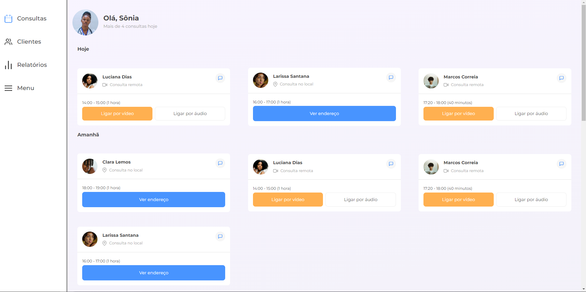

## Visão Geral

### O projeto

- Criar uma página de uma clínica com horários de consultas

### Screenshot

### Links

- Live Site URL: [Clínica X](https://clinica-responsiva-seven.vercel.app/)

## Meu processo

### Criado com

- HTML
- CSS

### O que eu aprendi

- Aprendi mais sobre responsividade

## Autor

- GitHub - [João Metzdorf](https://github.com/joaometzdorf)
